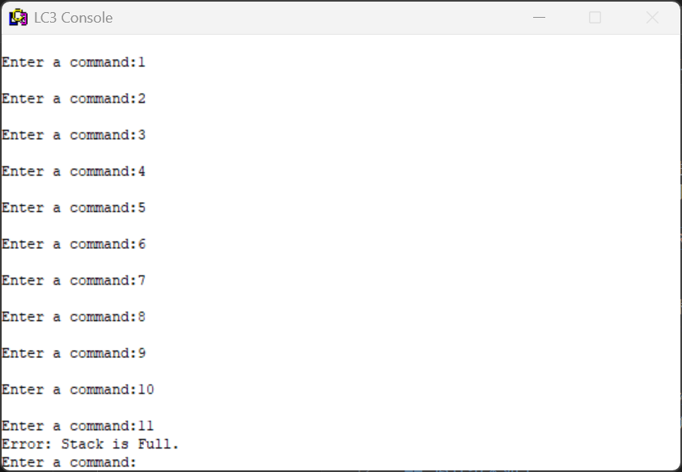
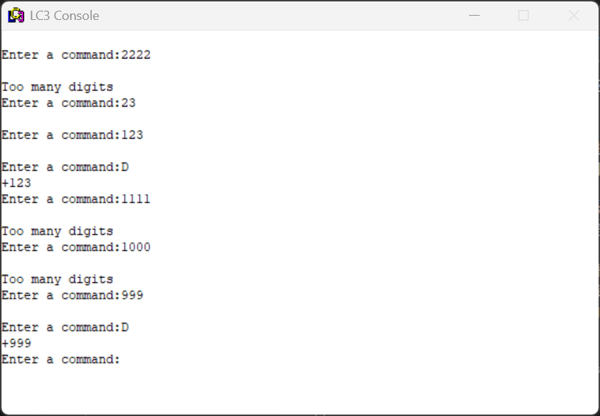
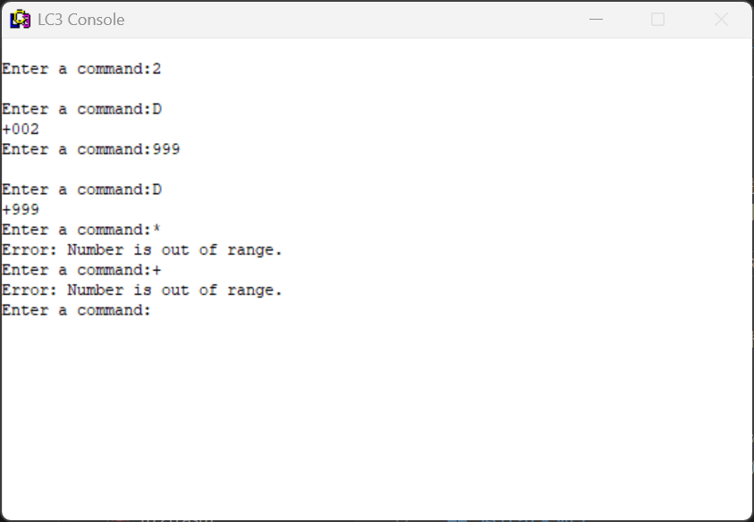
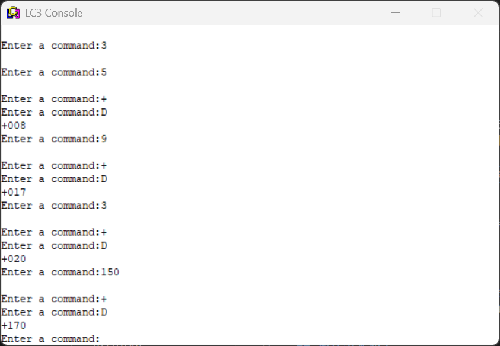
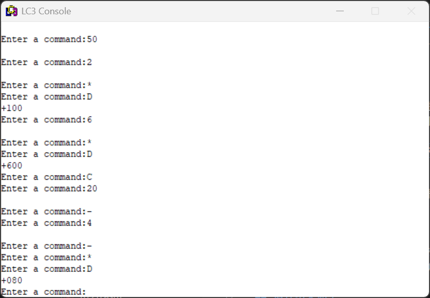
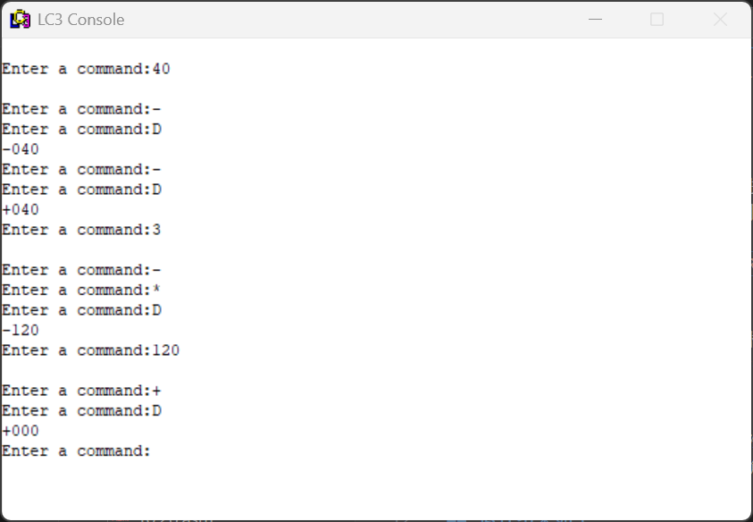
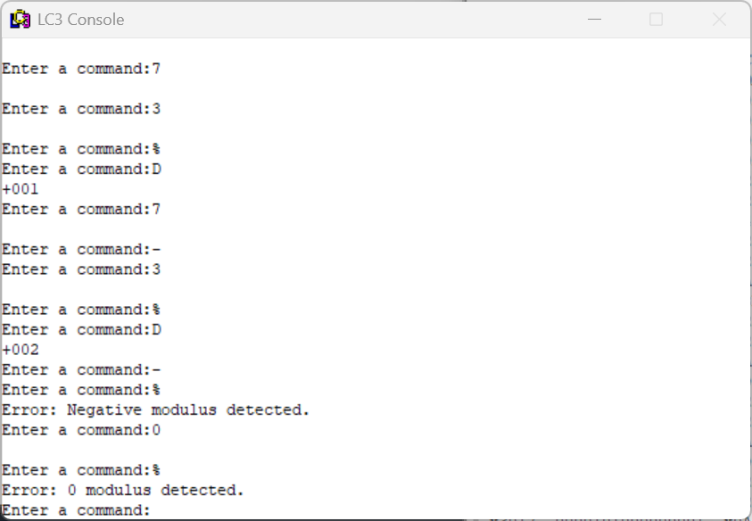
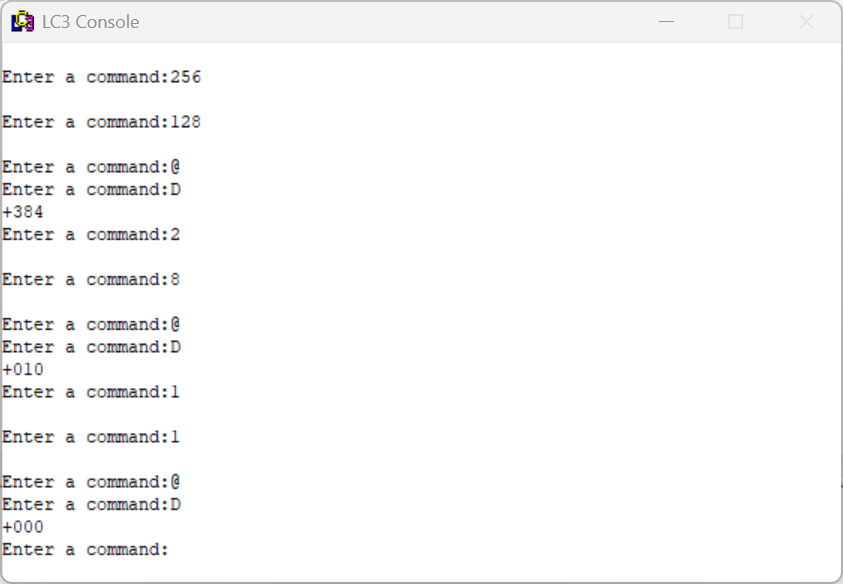

# 计算机体系结构 Lab2

## 前期调试与bug修复

复制样例代码至`lab2.asm`并直接进行编译，发现编译器报错：
- `OpAdd`, `OpMult`等指令无法用9位offset表达；

于是将`TEST`中的分支语句改为`JSR`指令，使得程序能够正常跳转，并修改判断条件使得能够依次判断指令类型。

编译通过后运行生成的文件，发现当栈内只有一个数字时输入`D`会显示栈内元素不足，发现原文件存在栈指针指向`BASE`位置时会认为栈空的bug，故将`POP`中的下溢判断条件由`BRz`改为`BRp`，即可解决该bug。

此外，运行代码时发现实行加法，乘法，取反后程序卡住无法正常运行，故将`RET`改为`JSR NewCommand`，使得程序能正确返回进程。

## 取模的实现

实现思路：首先检查除数符号。
- 除数非正：报错，重新入栈；
- 除数为正数：正常执行命令。

不断让被除数减去/加上除数，直到被除数小于除数且非负。

**元素出栈并检查符号，若除数为0则报错中止**
```asm
OpMod           JSR     POP           ; Get first source from stack.
                ADD     R5,R5,#0      ; Test for successful POP
                BRp     Exitmod       ; Failure
                ADD     R1,R0,#0      ; Make room for next POP
                JSR     POP           ; Get second source operand
                ADD     R5,R5,#0      ; Test for successful POP
                BRp     Restore1_mod  ; Failure; restore first POP
                ADD     R2,R0,#0      ; 
                ADD     R1,R1,#0
                BRp     PosModulus
                BRn     NegModulus
                LEA     R0,Mod0Msg    ; Otherwise, the modulus = 0
                TRAP    x22
                JSR     Restore2_mod
```

**若除数为正数则处理至被除数小于除数且非负**
```asm
PosModulus      AND     R0,R0,#0      ; Clear product register
                NOT     R1,R1
                ADD     R1,R1,#1      ; R1 = -(modulus)
PosModLoop1     ADD     R2,R2,R1      ; R2 <- R2 - modulus
                BRzp    PosModLoop1
                ADD     R1,R1,#-1     ; NegRes
                NOT     R1,R1         ; R1 = modulus
PosModLoop2     ADD     R2,R2,R1
                BRn     PosModLoop2
                ADD     R0,R2,#0      ; Move the result to R0
                JSR     PushMod
```

**若除数为负数则报错中止**
```asm
NegModulus      LEA     R0,NegModMsg
                TRAP    x22
                JSR     Restore2_mod
```

**结果入栈**
```asm
PushMod         JSR     PUSH
                JSR     NewCommand
Restore2_mod    ADD     R6,R6,#-1
Restore1_mod    ADD     R6,R6,#-1
Exitmod         JSR     NewCommand
Mod0Msg         .FILL   x000A
                .STRINGZ    "Error: 0 modulus detected."
NegModMsg       .FILL   x000A
                .STRINGZ    "Error: Negative modulus detected."
```
## 异或的实现

实现思路：利用ADD和AND，NOT操作和德摩根律实现异或操作。设操作数为$a$，$b$，则结果为：
$$\neg \left(\neg(a\land\neg b)\land\neg(\neg a\land b)\right)=(a\land\neg b)\lor(\neg a\land b)=a\textbf{ XOR }b$$

**元素出栈**
```asm
OpXOR           JSR     POP           ; Get first source from stack.
                ADD     R5,R5,#0      ; Test for successful POP
                BRp     Exitmod       ; Failure
                ADD     R1,R0,#0      ; Make room for next POP
                JSR     POP           ; Get second source operand
                ADD     R5,R5,#0      ; Test for successful POP
                BRp     Restore1_XOR  ; Failure; restore first POP
                ADD     R2,R0,#0      ; 
                AND     R0,R0,#0      ; Clear R0 for result
```

**计算异或表达式**
```asm
                NOT     R2,R2
                AND     R3,R1,R2      ; R3 <- a and not b
                
                NOT     R2,R2
                NOT     R1,R1
                AND     R4,R1,R2      ; R4 <- not a and b

                NOT     R3,R3
                NOT     R4,R4
                AND     R0,R3,R4
                NOT     R0,R0         ; R0 <- R3 or R4
                JSR     PUSHXOR
```

**结果入栈**
```asm
PUSHXOR         JSR     PUSH
                JSR     NewCommand
Restore2_XOR    ADD     R6,R6,#-1
Restore1_XOR    ADD     R6,R6,#-1
```

## 最终运行结果：

- 元素入栈以及上溢
  
    

- 展示，清空栈，下溢
  
    

- 输入范围检测  
  
    

- 计算范围检测  
  
    

- 加法  
  
    

- 乘法  
  
    

- 取反  
  
    

- 取模

    

- 异或

    